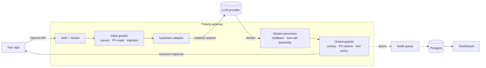

<div align="center">

# 🚧 Palang AI

**A security gateway for LLM apps and agents, built for Indonesian data.**

Point your app at Palang instead of your model provider. Every request gets PII masking,
prompt-injection detection, tool-call policy and leak detection, with an audit trail and a
dashboard. Your code stays the same.


[Why](#-why-palang) · [How it works](#-how-it-works) · [Get started](#-get-started) ·
[Configure guards](#-configure-the-guards) · [Production](#-running-in-production) ·
[Evaluation](#-how-well-it-works)

</div>

---

## 💡 Why Palang

Three things go wrong once an app starts talking to an LLM:

1. **Personal data leaves your infrastructure.** Users paste NIKs, phone numbers, emails and card
   numbers, and all of it goes straight to a third-party model.
2. **Instructions hide in content.** A web page, an email or a tool result can say "ignore your
   previous instructions", and an agent may do exactly that.
3. **Tool calls have real effects.** Once the model can call tools, one bad call can move money or
   delete data.

*Palang* means "barrier" in Indonesian. It sits between your app and the model and checks
everything that passes through. Adopting it is a one-line change:

```diff
  const client = new OpenAI({
-   baseURL: "https://api.openai.com/v1",
+   baseURL: "https://palang.your-company.internal/v1",
    apiKey: process.env.PALANG_API_KEY,
  });
```

Here's what that changes for a single message:

```text
Your user sends      →  "NIK saya 3171011506900001, tolong cek statusnya"
The model receives   →  "NIK saya [NIK_1], tolong cek statusnya"
The model replies    →  "Status untuk [NIK_1]: aktif."
Your user gets       →  "Status untuk 3171011506900001: aktif."
```

The real value never reaches the model provider, and your user never notices. It works with
streaming too, even when a placeholder is split across chunks.

## 🧭 How it works



- Guards run **in order**. PII is masked before the injection scan, and restored before the tool
  policy checks arguments, so policies see real values.
- Every guard runs in **`monitor`** (log what it would block) or **`enforce`** mode, so you can
  watch before you block anything.
- The audit log is written **asynchronously**, so the database never slows down a request.

## 🛡️ What it protects

| Guard | Catches | How |
|---|---|---|
| **`pii-id`** | NIK, NPWP, Indonesian phone numbers, emails, card numbers | Validates each value (NIK province and date, Luhn for cards), masks it as `[TYPE_N]`, restores it in the response, and flags PII the model writes out by itself |
| **`injection`** | "Ignore previous instructions", "abaikan instruksi sebelumnya", instructions hidden in tool output | Normalizes Unicode, zero-width characters and base64, then scores with English and Indonesian heuristics and an optional ML classifier |
| **`tool-policy`** | Tool calls you never meant to allow | Allow or deny by tool name, with typed constraints on arguments (`amount <= 1000000`, `currency in [IDR]`) |
| **`canary`** | A leaked system prompt | Plants a secret token in the system prompt and blocks or strips it if it ever shows up in the output |

Around the guards you also get an **audit log** with redacted content, a **dashboard**,
**Prometheus metrics**, and the guards as a **plain TypeScript library** you can use without the
gateway.

> [!NOTE]
> **Pre-release.** Everything in this README works and is tested. Container images, a
> `docker compose` setup and an npm release are still to come, so for now you run Palang from
> source.

## 🚀 Get started

This sets Palang up in front of your own app and model provider. Plan on about fifteen minutes.

### What you need

| | |
|---|---|
| [Bun](https://bun.sh) 1.3+ | runs the gateway (`bun --version`) |
| [Node.js](https://nodejs.org) 22+ | runs the dashboard (`node --version`) |
| Postgres 16 | stores the audit log and API keys; Docker is the quickest way to get one |
| An OpenAI-compatible API | OpenAI, or any provider or self-hosted server that speaks the same API, plus its API key |

No API key at hand? You can [try Palang with a mock model](#try-it-without-an-api-key) first.

### 1. Install

```sh
git clone <this-repo-url> palang-ai
cd palang-ai
bun install
```

### 2. Start Postgres

Skip this if you already have a Postgres 16 server. Otherwise, this container keeps its data in a
named volume so it survives restarts:

```sh
docker run -d --name palang-postgres \
  -e POSTGRES_USER=palang -e POSTGRES_PASSWORD=palang -e POSTGRES_DB=palang \
  -p 5432:5432 -v palang-pgdata:/var/lib/postgresql/data \
  postgres:16
```

### 3. Create your config

```sh
bun run setup
```

This creates two git-ignored files from their templates and never overwrites existing ones:

- **`.env`** holds secrets and connection settings. An admin token and a dashboard password are
  generated for you, and the password is printed once.
- **`palang.yaml`** describes your app (a *tenant*), its model provider and its guards.

Now make them yours.

**In `.env`**, point Palang at your model provider (and at your database, if it isn't the
container above):

```sh
UPSTREAM_BASE_URL=https://api.openai.com/v1
UPSTREAM_API_KEY=sk-...
```

**In `palang.yaml`**, describe your app. Rename the example tenant, list the models your app uses,
and start the guards in `monitor` mode so nothing gets blocked while you learn what your traffic
looks like:

```yaml
tenants:
  - id: my-app                      # used in the dashboard and when creating API keys
    failure_mode: fail_closed
    upstream:
      type: openai-compatible
      base_url: ${UPSTREAM_BASE_URL}
      api_key: ${UPSTREAM_API_KEY}
    allowed_models: ["gpt-4o-mini", "gpt-4o"]   # globs work too, e.g. "gpt-4o*"
    guards:
      pii-id:                       # masking happens in either mode
        mode: enforce
        entities: [NIK, NPWP, PHONE_ID, EMAIL, CARD]
      injection:
        mode: monitor
      canary:
        mode: monitor
        on_detect: block
      tool-policy:
        mode: monitor
        default: deny
        rules: []                   # add your tools before enforcing, see "Configure the guards"
```

Every setting is explained in [`.env.example`](.env.example) and
[`palang.example.yaml`](palang.example.yaml).

### 4. Create the database tables

```sh
bun run db:migrate
```

### 5. Start Palang

Run each of these in its own terminal:

```sh
bun run gateway     # your app talks to :8080, the admin API is on :8081
```

```sh
bun run dashboard   # builds, then serves on http://localhost:3000
```

Open <http://localhost:3000> and sign in with the password from `.env`.

### 6. Give your app an API key

Your app authenticates to Palang with its own key, never the provider's. In the dashboard, go to
**API keys**, pick your tenant and create a key. Copy it right away, because it's shown only once.

<details>
<summary>Prefer the command line?</summary>

```sh
export PALANG_ADMIN_TOKEN=$(grep '^PALANG_ADMIN_TOKEN=' .env | cut -d= -f2)

curl -s -X POST localhost:8081/admin/tenants/my-app/keys \
  -H "Authorization: Bearer $PALANG_ADMIN_TOKEN" \
  -H 'content-type: application/json' -d '{"name":"production"}'
```

</details>

### 7. Connect your app

Keep using the OpenAI SDK you already use. Only the base URL and the key change:

```ts
import OpenAI from "openai";

const client = new OpenAI({
  baseURL: "http://localhost:8080/v1", // your Palang gateway
  apiKey: process.env.PALANG_API_KEY, // the key from step 6
});

const reply = await client.chat.completions.create({
  model: "gpt-4o-mini",
  messages: [{ role: "user", content: "NIK saya 3171011506900001, tolong cek statusnya" }],
});
```

Streaming, tool calls and every other OpenAI-compatible SDK work the same way. Send a request and
it shows up under **Events** in the dashboard, with each guard's decision.

### 8. From monitoring to enforcing

Let real traffic run through for a while, then use the dashboard to decide what to block:

1. **Overview** shows how much each guard *would* have blocked, and **Events** shows why, request
   by request.
2. Add your tools to `tool-policy` and tune the injection thresholds until the would-blocks look
   right.
3. Switch the guards you trust to `mode: enforce` and restart the gateway. Config is read at
   startup.

### Try it without an API key

Palang ships with a mock model server that speaks the OpenAI API. Keep the `UPSTREAM_*` values
from `bun run setup`, leave the example tenant (`demo`) as it is, then:

```sh
bun run mock        # in its own terminal, next to the gateway
```

Create a key for the `demo` tenant and use the model `mock-echo`, which repeats your message
back. Send it a NIK and you get the NIK back, while the "model" only ever saw `[NIK_1]`.

## 🔧 Configure the guards

Guards are configured per tenant in `palang.yaml`. A fuller example:

```yaml
guards:
  pii-id:
    mode: enforce
    entities: [NIK, NPWP, PHONE_ID, EMAIL, CARD]
    roles: [user, tool, assistant]  # which messages to mask (default)
    preserve_hint: true             # asks the model to keep placeholders as they are
    mask_new_output_pii: false      # also mask PII the model writes by itself
  injection:
    mode: enforce
    roles: [user, tool]             # tool output is where indirect injection hides
    flag_threshold: 0.5
    block_threshold: 0.85
  tool-policy:
    mode: enforce
    default: deny                   # anything not matched below is blocked
    rules:
      - tool: "search_*"
        action: allow
      - tool: "delete_*"
        action: deny
        reason: destructive_tool
      - tool: transfer_funds
        action: allow
        constraints:                # all must pass, or the call is blocked
          - { path: amount, op: lte, value: 1000000 }
          - { path: currency, op: in, value: [IDR] }
  canary:
    mode: enforce
    on_detect: block                # or `flag` to strip the token and continue
```

A few things worth knowing:

- **`failure_mode`** decides what happens when a guard errors or times out: `fail_closed` blocks
  the request, `fail_open` lets it through with a flag.
- **`tool-policy`** checks rules top to bottom and the first match wins. Constraint types are
  strict, so `"1000"` (a string) never satisfies `lte: 1000000`.
- **`injection`** has a false-positive rate that is still too high to block on without tuning
  (see [How well it works](#-how-well-it-works)). Watch it in `monitor` first.

<details>
<summary><b>Adding the injection classifier (optional)</b></summary>

The ML classifier raises injection recall but is off by default. It uses
[`protectai/deberta-v3-base-prompt-injection-v2`](https://huggingface.co/protectai/deberta-v3-base-prompt-injection-v2)
(fp32, about 739 MB), which is slow on CPU: roughly 0.6 to 1 second per 512-token window on an
Apple M1 ([decision 0005](docs/decisions/0005-injection-l2-classifier.md)).

```sh
bun run --filter @palang-ai/gateway download-model   # saves it into ./models
```

Then enable it for a tenant, with a timeout:

```yaml
injection:
  mode: monitor
  timeout_ms: 2000
  classifier:
    enabled: true
```

The gateway refuses to start if an enabled model can't be loaded.

</details>

## ⚙️ Configuration reference

**`palang.yaml`** holds tenants, upstreams and guards. It's validated at startup and supports
`${VAR}` references to `.env`. Template: [`palang.example.yaml`](palang.example.yaml).

**`.env`** holds secrets and connection settings. The gateway, the dashboard and migrations all
read it from the repo root. Values already set in the environment win, so in a container you can
skip the file. Template: [`.env.example`](.env.example).

| Variable | Required | Used by | Purpose |
|---|:---:|---|---|
| `DATABASE_URL` | ✅ | gateway, migrations | Postgres 16 connection string |
| `PALANG_ADMIN_TOKEN` | ✅ | gateway, dashboard | Admin API token; also signs dashboard sessions |
| `DASHBOARD_PASSWORD` | ✅ | dashboard | Sign-in password |
| `UPSTREAM_BASE_URL`, `UPSTREAM_API_KEY` | ✅ | gateway | Your model provider, as referenced from `palang.yaml` |
| `PALANG_CONFIG` | | gateway | Config file path (default `./palang.yaml`) |
| `LOG_LEVEL` | | gateway | Log level (default `info`) |
| `PALANG_ADMIN_URL` | | dashboard | The gateway's admin API (default `http://localhost:8081`) |

If a required variable is missing, the app stops at startup and names it.

| Port | Serves |
|---|---|
| `8080` | Your app's API: `/v1/chat/completions`, `/v1/models`, plus `/healthz` and `/readyz` |
| `8081` | Admin API and Prometheus `/metrics` (both need the admin token) |

<details>
<summary><b>Audit log and stored content</b></summary>

Every request is recorded with each guard's decision and latency. `audit.content_mode` decides
what content is kept alongside:

- **`redacted`** (default): messages with every PII value and the canary masked, whether or not
  the tenant uses the `pii-id` guard.
- **`hash`**: a SHA-256 per message, no text.
- **`none`**: no content at all.

Events older than `audit.retention_days` (default 30) are deleted daily.

</details>

## 🏭 Running in production

Until container images are published, run `bun run gateway` and `bun run dashboard` under your
process manager of choice (systemd, pm2, and so on). Before real users hit it:

- [ ] **Keep port `8081` private.** The admin API and `/metrics` must not be reachable from the
      internet.
- [ ] **Put TLS in front** with a reverse proxy, and have it send `X-Forwarded-Proto: https` so
      dashboard session cookies are marked `Secure`.
- [ ] **Use strong secrets.** Keep the generated `PALANG_ADMIN_TOKEN` and set a real
      `DASHBOARD_PASSWORD`.
- [ ] **Use a managed or backed-up Postgres 16**, and set `audit.retention_days` to what your
      policy allows.
- [ ] **Wire up health checks and metrics:** `/readyz` on `8080` (fails when the database is
      unreachable) and `/metrics` on `8081` with the admin token as a bearer token.
- [ ] **Pick your limits:** `server.max_body_bytes` (default 1 MB) and each upstream's
      `timeout_ms` (default 120 s).
- [ ] **Ship the logs.** The gateway writes one JSON line per request to stdout, without message
      content.

## 📦 Use the guards as a library

`@palang-ai/guards` (the pipeline runner and every guard in one package) uses only Web Standard
APIs, so it runs anywhere, with no gateway and no Postgres. It isn't on npm yet; inside this repo:

```ts
import {
  DEFAULT_INJECTION_CONFIG,
  DEFAULT_PII_ID_CONFIG,
  createInjectionInputGuard,
  createPiiIdInputGuard,
  createPiiIdOutputGuard,
  type GuardContext,
} from "@palang-ai/guards";

const ctx: GuardContext = {
  requestId: crypto.randomUUID(),
  tenantId: "local",
  model: "gpt-4o-mini",
  stream: false,
  messages: [{ role: "user", content: "NIK saya 3171011506900001, tolong cek statusnya" }],
  piiVault: new Map(),
  signal: new AbortController().signal,
  metadata: {},
};

await createPiiIdInputGuard(DEFAULT_PII_ID_CONFIG).check(ctx);
ctx.messages[0]?.content; // "NIK saya [NIK_1], tolong cek statusnya"

const injection = await createInjectionInputGuard(DEFAULT_INJECTION_CONFIG).check(ctx);
injection.action; // "allow" | "flag" | "block"

const { text } = await createPiiIdOutputGuard(DEFAULT_PII_ID_CONFIG).checkText!(
  "Status untuk [NIK_1]: aktif.",
  ctx,
);
text; // "Status untuk 3171011506900001: aktif."
```

## 📈 How well it works

Detection quality is measured, not claimed. `bun run eval` reproduces the report on synthetic
datasets, and results are kept in [`evals/results/`](evals/results/).

**Prompt injection**, on a held-out test set at the flag threshold (0.5):

| Layer | Recall | False positives | Recall 🇮🇩 | Recall 🇬🇧 |
|---|---:|---:|---:|---:|
| Heuristics only | 48.3% | 22.9% | 51.6% | 41.7% |
| Classifier only | 81.3% | 27.1% | 71.9% | 100% |
| **Combined** | **92.4%** | 39.9% | 88.5% | 100% |

**PII**, on 550 synthetic samples: **93.0% precision and 99.7% recall** on supported formats, and
the streaming restore round trip succeeds on **100%** of masked samples.

> [!IMPORTANT]
> The datasets are synthetic, and the heuristics were written by the same author as the samples,
> so treat these numbers as optimistic. The combined false-positive rate is too high to block on,
> which is why `injection` should start in `monitor` mode.

## 🚨 Known limitations

- **Audit events can be lost** on a crash or under heavy load, because the queue lives in memory
  by design.
- **A streaming block can't take back text already sent.** It ends the stream at that point.
- **Paraphrased placeholders aren't restored.** If the model rewrites `[NIK_1]`, that value stays
  masked.
- **The classifier is English-centric.** Indonesian accuracy is lower, and long, repetitive
  benign text can score as an injection.
- **PII edge cases:** any 15-digit number reads as an NPWP, Luhn and NIK occasionally collide,
  and spaced NIKs, phone numbers in parentheses and `[at]` emails aren't detected.
- **Scope:** OpenAI-compatible providers only, tenants live in config, and there is one admin
  token.

## 🛠️ Contributing

```sh
bun run typecheck && bun run test    # gateway tests need DATABASE_URL (Postgres 16)
bun run lint && bun run format
bun run eval
```

| Path | What's inside |
|---|---|
| `gateway/` | The gateway (Hono on Bun): public and admin API, stream processor, audit, database schema and migrations |
| `dashboard/` | The dashboard (Next.js) |
| `guards/` | `@palang-ai/guards`: the pipeline runner and the four guards |
| `mock-upstream/` | A scriptable fake OpenAI server for tests and demos |
| `evals/` | Datasets, generators and the eval report |
| `scripts/` | `bun run setup` |

The full technical spec is [`docs/TSD.md`](docs/TSD.md). Feature specs live in
[`docs/plans/`](docs/plans/overview.md) and design decisions in [`docs/decisions/`](docs/decisions/).

## 📄 License

[MIT](docs/decisions/0006-license-mit.md). The optional classifier model is Apache-2.0 and
downloaded separately, and `@huggingface/transformers` pulls in `sharp`/libvips
(LGPL-3.0-or-later).
