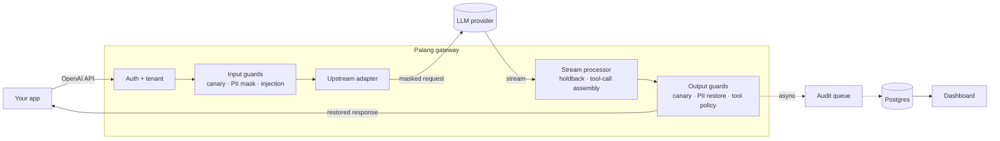

<div align="center">

# 🚧 Palang AI

**A security gateway for LLM apps and agents — built for Indonesian data.**

Change one line (`base_url`) and every request to your model gets PII masking, prompt-injection
detection, tool-call policy and leak detection — with an audit trail and a dashboard.


[Getting started](#-getting-started) · [How it works](#-how-it-works) · [Guards](#-guards) ·
[Configuration](#-configuration) · [Evaluation](#-evaluation) ·
[Limitations](#-known-limitations)

</div>

---

## Why

Your app sends user messages — NIKs, phone numbers, emails, card numbers — straight to a third-party
model. Your agent reads web pages and tool results that can carry hidden instructions. And once the
model starts calling tools, a single bad call can move money or delete data.

*Palang* means "barrier" in Indonesian. It sits between your app and the model and checks
everything that passes through, **without changing your code**:

```diff
  const client = new OpenAI({
-   baseURL: "https://api.openai.com/v1",
+   baseURL: "https://palang.internal/v1",
    apiKey: process.env.PALANG_API_KEY,
  });
```

### What the model sees vs. what your user gets

```text
Your user sends      →  "NIK saya 3171011506900001, tolong cek statusnya"
The model receives   →  "NIK saya [NIK_1], tolong cek statusnya"
The model replies    →  "Status untuk [NIK_1]: aktif."
Your user gets       →  "Status untuk 3171011506900001: aktif."
```

The real value never leaves your infrastructure — and it's restored even when a placeholder is
split across streaming chunks.

## ✨ Features

- 🇮🇩 **Indonesian PII, done properly** — NIK (with province/date validation), NPWP, Indonesian
  phone numbers, emails and Luhn-checked card numbers, masked and restored per request.
- 🛡️ **Prompt-injection detection** on user *and* tool messages, in English and Indonesian, with an
  optional ML classifier.
- 🔧 **Tool-call policy** — allow/deny by tool name with typed argument constraints
  (`amount <= 1000000`, `currency in [IDR]`).
- 🐤 **Canary tokens** that catch a leaked system prompt, in text or tool calls.
- 👀 **Monitor mode everywhere** — watch what *would* be blocked before you enforce anything.
- ⚡ **Streaming-first** — works with SSE streaming and never awaits the database on the request
  path.
- 📊 **Dashboard, audit log and Prometheus metrics**, with stored content always redacted.
- 📦 **Use it without the gateway** — the guards are a plain TypeScript library.

> [!NOTE]
> **Pre-release.** Everything below works and is tested, but there's no `docker compose` setup,
> container image or npm release yet — for now you run it from source.

## 🚀 Getting started

This walks you from a fresh clone to a guarded request and the dashboard, in about ten minutes.

### 1. Prerequisites

| Tool | Why | Check |
|---|---|---|
| [Bun](https://bun.sh) 1.3+ | Runs the gateway | `bun --version` |
| [Docker](https://docs.docker.com/get-docker/) | Runs Postgres | `docker --version` |
| [Node.js](https://nodejs.org) 22+ | Runs the dashboard | `node --version` |
| `git`, `curl`, `openssl` | Setup | — |

### 2. Get the code

```sh
git clone <this-repo-url> palang-ai
cd palang-ai
bun install
```

### 3. Start Postgres

Palang keeps its audit log and API keys in Postgres 16. This container keeps its data in a named
volume, so it survives restarts:

```sh
docker run -d --name palang-postgres \
  -e POSTGRES_USER=palang -e POSTGRES_PASSWORD=palang -e POSTGRES_DB=palang \
  -p 5432:5432 -v palang-pgdata:/var/lib/postgresql/data \
  postgres:16
```

### 4. Configure

```sh
bun run setup
```

This creates two git-ignored files from their templates, and never overwrites existing ones:

- **`.env`** — the one environment file for everything, with a generated admin token and
  dashboard password (printed once — you can change it in `.env`). Every setting is explained in
  [`.env.example`](.env.example).
- **`palang.yaml`** — the gateway config: one tenant, `demo`, with every guard switched on.

### 5. Create the database tables

```sh
bun run db:migrate
```

### 6. Pick a model provider

<table>
<tr><th>Try it out — no API key needed</th><th>Use a real model</th></tr>
<tr><td>

Start the bundled mock server in its **own terminal**. It speaks the OpenAI API; the
`mock-echo` model simply repeats your message back.

```sh
bun run mock
```

</td><td>

In `.env`, swap the `UPSTREAM_*` lines for your provider's (they're there, commented out):

```sh
UPSTREAM_BASE_URL=https://api.openai.com/v1
UPSTREAM_API_KEY=sk-...
```

`gpt-4o-mini` is already in `allowed_models`; add any other model you use in `palang.yaml`.

</td></tr>
</table>

### 7. Start the gateway

In another terminal:

```sh
bun run gateway
```

It listens on `:8080` for your app and on `:8081` for admin.

### 8. Create an API key

Your app authenticates to Palang with its own key, not the provider's. Grab the admin token from
`.env` and create one:

```sh
export PALANG_ADMIN_TOKEN=$(grep '^PALANG_ADMIN_TOKEN=' .env | cut -d= -f2)

curl -s -X POST localhost:8081/admin/tenants/demo/keys \
  -H "Authorization: Bearer $PALANG_ADMIN_TOKEN" \
  -H 'content-type: application/json' -d '{"name":"my-app"}'
```

Copy the `"key"` from the response (`plg_live_…`) — **it's shown only once**. (You can also create
keys in the dashboard.)

### 9. Send your first request

```sh
export PALANG_API_KEY=plg_live_...   # the key from step 8

curl -s localhost:8080/v1/chat/completions \
  -H "Authorization: Bearer $PALANG_API_KEY" -H 'content-type: application/json' \
  -d '{"model":"mock-echo","messages":[{"role":"user","content":"NIK saya 3171011506900001"}]}'
```

With the mock, the reply contains your NIK — yet the upstream only ever received
`NIK saya [NIK_1]`. 🎉 (Using a real provider? Swap `mock-echo` for `gpt-4o-mini`.)

From your own code, it's the regular OpenAI SDK with a different `baseURL`:

```ts
import OpenAI from "openai";

const client = new OpenAI({ baseURL: "http://localhost:8080/v1", apiKey: process.env.PALANG_API_KEY });
const reply = await client.chat.completions.create({
  model: "mock-echo",
  messages: [{ role: "user", content: "Email saya budi@example.com" }],
});
```

### 10. Open the dashboard

In another terminal:

```sh
bun run dashboard
```

Open <http://localhost:3000> and sign in with the `DASHBOARD_PASSWORD` from `.env`. The request
from step 9 is already in **Events**.

### Stopping and starting again

- Stop the gateway, mock server and dashboard with <kbd>Ctrl</kbd>+<kbd>C</kbd>.
- Stop Postgres with `docker stop palang-postgres`; bring it back with
  `docker start palang-postgres`. Your data stays in the `palang-pgdata` volume.
- Next time: start Postgres, then `bun run mock` (if you use it), `bun run gateway` and
  `bun run dashboard`.

### Where next

- Edit `palang.yaml` to shape the guards for your app — e.g. the demo tenant's `tool-policy` denies
  **every** tool call until you add rules (see [Guards](#-guards)).
- Start guards in `monitor` mode, watch the dashboard, then switch to `enforce`.

## 🧭 How it works



- Guards run **in order** — PII is masked before the injection scan, and restored before the tool
  policy checks arguments.
- Each guard has its own **`enforce` / `monitor`** mode and a **`fail_open` / `fail_closed`**
  behavior on timeout or error.
- Audit writes are **fire-and-forget** through an in-memory queue, so the database never slows a
  request down.

## 🧱 Guards

| Guard | What it catches | How |
|---|---|---|
| **`pii-id`** | NIK, NPWP, Indonesian phones, emails, card numbers | Validates, masks as `[TYPE_N]`, restores in the response; flags PII the model writes out itself |
| **`injection`** | "Ignore previous instructions…", "abaikan instruksi sebelumnya…", hidden instructions in tool output | Unicode/zero-width/base64 normalization + EN/ID heuristics, optional ONNX classifier |
| **`tool-policy`** | Tool calls you didn't intend to allow | Glob rules + typed constraints (`eq`, `lte`, `in`, `regex`, …) on arguments |
| **`canary`** | A leaked system prompt | Random token planted in the system prompt; blocked or stripped if it shows up in output |

<details>
<summary><b>Example guard config</b></summary>

```yaml
guards:
  pii-id:
    mode: enforce
    entities: [NIK, NPWP, PHONE_ID, EMAIL, CARD]
  injection:
    mode: monitor            # log what would be blocked, don't block yet
    flag_threshold: 0.5
    block_threshold: 0.85
  tool-policy:
    mode: enforce
    default: deny
    rules:
      - tool: "search_*"
        action: allow
      - tool: "delete_*"
        action: deny
        reason: destructive_tool
      - tool: transfer_funds
        action: allow
        constraints:
          - { path: amount, op: lte, value: 1000000 }
          - { path: currency, op: in, value: [IDR] }
  canary:
    mode: enforce
    on_detect: block
```

</details>

## 🔩 Configuration

Two files, both created by `bun run setup`:

- **`palang.yaml`** — tenants, upstreams and guard policies, validated at startup, with `${VAR}`
  interpolation. Template: [`palang.example.yaml`](palang.example.yaml).
- **`.env`** — secrets and connection settings, read from the repo root by the gateway, the
  dashboard and migrations alike. Template: [`.env.example`](.env.example). In a container, set
  the same variables in the environment instead.

| Variable | Required | Used by | Purpose |
|---|:---:|---|---|
| `DATABASE_URL` | ✅ | gateway, migrations | Postgres 16 connection string |
| `PALANG_ADMIN_TOKEN` | ✅ | gateway, dashboard | Admin API token; also signs dashboard sessions |
| `DASHBOARD_PASSWORD` | ✅ | dashboard | Sign-in password |
| `UPSTREAM_BASE_URL`, `UPSTREAM_API_KEY` | ✅* | gateway | The model provider (*as referenced by the example `palang.yaml`) |
| `PALANG_CONFIG` | | gateway | Config path (default `./palang.yaml`) |
| `LOG_LEVEL` | | gateway | pino log level (default `info`) |
| `PALANG_ADMIN_URL` | | dashboard | Gateway admin API (default `http://localhost:8081`) |

A missing required variable stops the app at startup with a message naming it.

| Port | Serves |
|---|---|
| `8080` | Public API — `/v1/chat/completions`, `/v1/models`, `/healthz`, `/readyz` |
| `8081` | Admin API and Prometheus `/metrics` |

> [!WARNING]
> Never expose the admin port (`8081`) to the internet.

<details>
<summary><b>Audit log and stored content</b></summary>

`audit.content_mode` decides what's kept with each event:

- **`redacted`** (default) — messages stored with every PII value and the canary masked, whether or
  not the tenant uses the `pii-id` guard.
- **`hash`** — a SHA-256 per message, no text.
- **`none`** — decisions and latencies only.

Events older than `audit.retention_days` (default 30) are deleted daily.

</details>

<details>
<summary><b>Enabling the injection classifier (optional)</b></summary>

The classifier is off by default. It uses
[`protectai/deberta-v3-base-prompt-injection-v2`](https://huggingface.co/protectai/deberta-v3-base-prompt-injection-v2)
(fp32, ~739 MB), which is slow on CPU — roughly 0.6–1 s per 512-token window on an Apple M1
([decision 0005](docs/decisions/0005-injection-l2-classifier.md)).

```sh
bun run --filter @palang-ai/gateway download-model   # into ./models
```

Then set `classifier.enabled: true` on the tenant's `injection` guard — ideally with a
`timeout_ms`. The gateway won't start if an enabled model can't be loaded.

</details>

## 📦 Using the guards without the gateway

`@palang-ai/core` and `@palang-ai/guards` use only Web Standard APIs, so they run anywhere —
no gateway, no Postgres. They aren't on npm yet; inside this repo:

```ts
import {
  DEFAULT_INJECTION_CONFIG,
  DEFAULT_PII_ID_CONFIG,
  createInjectionInputGuard,
  createPiiIdInputGuard,
  createPiiIdOutputGuard,
} from "@palang-ai/guards";
import type { GuardContext } from "@palang-ai/core";

const ctx: GuardContext = {
  requestId: crypto.randomUUID(),
  tenantId: "local",
  model: "gpt-4o-mini",
  stream: false,
  messages: [{ role: "user", content: "NIK saya 3171011506900001, tolong cek statusnya" }],
  piiVault: new Map(),
  signal: new AbortController().signal,
  metadata: {},
};

await createPiiIdInputGuard(DEFAULT_PII_ID_CONFIG).check(ctx);
ctx.messages[0]?.content; // "NIK saya [NIK_1], tolong cek statusnya"

const injection = await createInjectionInputGuard(DEFAULT_INJECTION_CONFIG).check(ctx);
injection.action; // "allow" | "flag" | "block"

const { text } = await createPiiIdOutputGuard(DEFAULT_PII_ID_CONFIG).checkText!(
  "Status untuk [NIK_1]: aktif.",
  ctx,
);
text; // "Status untuk 3171011506900001: aktif."
```

## 📈 Evaluation

Detection quality is measured, not claimed: `bun run eval` reproduces the report on synthetic
datasets, and results land in [`evals/results/`](evals/results/).

**Prompt injection** — held-out test set, flag threshold 0.5:

| Layer | Recall | False positives | Recall 🇮🇩 | Recall 🇬🇧 |
|---|---:|---:|---:|---:|
| Heuristics only | 48.3% | 22.9% | 51.6% | 41.7% |
| Classifier only | 81.3% | 27.1% | 71.9% | 100% |
| **Combined** | **92.4%** | 39.9% | 88.5% | 100% |

**PII** — 550 synthetic samples: **93.0% precision, 99.7% recall** on supported formats, and the
streaming restore round trip succeeds on **100%** of masked samples.

> [!IMPORTANT]
> The datasets are synthetic and the heuristics were written by the same author as the samples,
> so treat these as optimistic. The combined false-positive rate is too high for blocking — run
> `injection` in **`monitor`** mode.

## 🚨 Known limitations

- **Audit events can be lost** on a crash or under heavy load — the queue is in memory by design.
- **Streaming blocks can't unsend text** — a block ends the stream after what was already sent.
- **Paraphrased placeholders** — if the model rewrites `[NIK_1]`, that value isn't restored.
- **The classifier is English-centric** — Indonesian accuracy is lower, and long, repetitive benign
  text can score as an injection.
- **PII edge cases** — any 15-digit number reads as an NPWP; occasional Luhn/NIK collisions;
  spaced NIKs, parenthesized phone numbers and `[at]` emails aren't detected.
- **Scope** — OpenAI-compatible upstreams only; tenants are defined in config; a single admin token.

## 🛠️ Development

```sh
bun run typecheck && bun run test    # db and gateway tests need DATABASE_URL (Postgres 16)
bun run lint && bun run format
bun run eval
```

<details>
<summary><b>Repository layout</b></summary>

| Path | What |
|---|---|
| `apps/gateway` | The gateway (Hono on Bun): public API, admin API, stream processor, audit |
| `apps/dashboard` | The dashboard (Next.js) |
| `apps/mock-upstream` | A scriptable fake OpenAI server for tests and demos |
| `packages/core` | Guard types and the pipeline runner |
| `packages/guards` | `pii-id`, `injection`, `tool-policy`, `canary` |
| `packages/db` | Drizzle schema and migrations |
| `evals/` | Datasets, generators and the eval report |

The full technical spec is [`docs/TSD.md`](docs/TSD.md); feature specs are in
[`docs/plans/`](docs/plans/overview.md) and design decisions in [`docs/decisions/`](docs/decisions/).

</details>

## 📄 License

[MIT](docs/decisions/0006-license-mit.md). The optional classifier model is Apache-2.0 and
downloaded separately; `@huggingface/transformers` pulls in `sharp`/libvips (LGPL-3.0-or-later).
