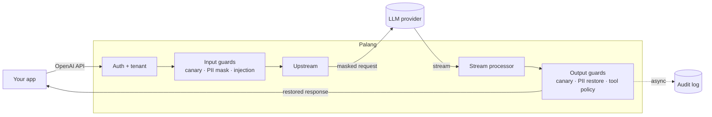

<div align="center">


<h3>A security gateway for LLM apps, built for Indonesian data.</h3>

<p>
  
  
  
</p>

<p>
  <a href="#get-started">Get started</a> ·
  <a href="#configuration">Configuration</a> ·
  <a href="#how-well-it-works">Evaluation</a>
</p>

</div>

<br />

Once your app talks to an LLM, three things can go wrong:

- **Personal data leaves your infrastructure.** NIKs, phone numbers and emails go straight to a
  third-party model.
- **Instructions hide in content.** A web page or tool result can tell your agent to "ignore
  previous instructions".
- **Tool calls have real effects.** One bad call can move money or delete data.

Palang sits between your app and the model and checks everything that passes through. Adopting it
is a one-line change:

```diff
- baseURL: "https://api.openai.com/v1",
+ baseURL: "https://palang.your-company.internal/v1",
```

What that changes for a single message:

```text
Your user sends      →  "NIK saya 3171011506900001, tolong cek statusnya"
The model receives   →  "NIK saya [NIK_1], tolong cek statusnya"
Your user gets back  →  "Status untuk 3171011506900001: aktif."
```

## What it does

| | |
|---|---|
| **PII masking** | NIK, NPWP, phone numbers, emails and card numbers never reach the model. They're masked in every text field of the request and restored in the reply, streaming included. |
| **Injection detection** | Flags or blocks prompt injection in user and tool messages, in English and Indonesian. |
| **Tool-call policy** | Allows only the tools you list, with limits on their arguments. |
| **Leak detection** | Catches your system prompt showing up in the output. |

Each guard can run in `monitor` mode (log only) before you `enforce` it. Every request lands in an
audit log, a dashboard and Prometheus metrics.

<details>
<summary><b>How it works</b></summary>
<br />



- Guards run in order: PII is masked before the injection scan, and restored before the tool
  policy checks arguments.
- The audit log is written in the background, so it never slows a request down.

</details>

> [!NOTE]
> Pre-release. Run it from source for now; container images and an npm package are on the way.

## Get started

You need [Bun](https://bun.sh) 1.3+, [Node.js](https://nodejs.org) 22+, Docker and an
OpenAI-compatible API key.

**1. Install**

```sh
git clone <this-repo-url> palang-ai && cd palang-ai
bun install

docker run -d --name palang-postgres -p 5432:5432 -v palang-pgdata:/var/lib/postgresql/data \
  -e POSTGRES_USER=palang -e POSTGRES_PASSWORD=palang -e POSTGRES_DB=palang postgres:16

bun run setup        # creates .env (with generated secrets) and palang.yaml
bun run db:migrate
```

**2. Configure**

Set your provider in `.env`:

```sh
UPSTREAM_BASE_URL=https://api.openai.com/v1
UPSTREAM_API_KEY=sk-...
```

Describe your app in `palang.yaml`. Start the guards in `monitor` so nothing is blocked yet:

```yaml
tenants:
  - id: my-app
    failure_mode: fail_closed
    upstream:
      type: openai-compatible
      base_url: ${UPSTREAM_BASE_URL}
      api_key: ${UPSTREAM_API_KEY}
    allowed_models: ["gpt-4o-mini"]
    guards:
      pii-id: { mode: enforce, entities: [NIK, NPWP, PHONE_ID, EMAIL, CARD] }
      injection: { mode: monitor }
      canary: { mode: monitor, on_detect: block }
      tool-policy: { mode: monitor, default: deny, rules: [] }
```

**3. Run**

```sh
bun run gateway      # your app → :8080 · admin → 127.0.0.1:8081
bun run dashboard    # http://localhost:3000 · password in .env
```

**4. Connect your app**

Create an API key in the dashboard under **API keys**, then change two lines:

```ts
const client = new OpenAI({
  baseURL: "http://localhost:8080/v1",
  apiKey: process.env.PALANG_API_KEY, // your Palang key, not the provider's
});
```

Requests appear under **Events**. When the would-block decisions look right, switch the guards to
`enforce` and restart the gateway.

> [!TIP]
> No API key? Run `bun run mock` and use the `demo` tenant with the model `mock-echo`, which
> echoes your message back.

## Configuration

| File | Holds | Template |
|---|---|---|
| `palang.yaml` | Tenants, providers and guards | [`palang.example.yaml`](palang.example.yaml) |
| `.env` | Secrets, shared by the gateway, dashboard and migrations | [`.env.example`](.env.example) |

<details>
<summary><b>All guard options</b></summary>
<br />

```yaml
guards:
  pii-id:
    mode: enforce
    entities: [NIK, NPWP, PHONE_ID, EMAIL, CARD]
    mask_new_output_pii: false     # also mask PII the model writes itself
  injection:
    mode: monitor
    flag_threshold: 0.5
    block_threshold: 0.85
  tool-policy:
    mode: enforce
    default: deny                  # anything not matched is blocked
    rules:
      - { tool: "search_*", action: allow }
      - { tool: "delete_*", action: deny, reason: destructive_tool }
      - tool: transfer_funds
        action: allow
        constraints:               # all must pass
          - { path: amount, op: lte, value: 1000000 }
          - { path: currency, op: in, value: [IDR] }
  canary:
    mode: enforce
    on_detect: block               # or flag: strip the token and continue
```

- `failure_mode: fail_closed` blocks a request when a guard errors; `fail_open` lets it through.
  `pii-id` always blocks on error, so PII is never sent unmasked.
- An optional ML classifier improves injection detection but is slow on CPU. Read
  [decision 0005](docs/decisions/0005-injection-l2-classifier.md) before enabling it.

</details>

## Use it as a library

`@palang-ai/guards` has no dependencies and runs on Node, Bun, Deno and the edge. Not on npm yet;
inside this repo:

```ts
import { DEFAULT_PII_ID_CONFIG, createPiiIdInputGuard, type GuardContext } from "@palang-ai/guards";

const ctx: GuardContext = {
  requestId: crypto.randomUUID(),
  tenantId: "local",
  model: "gpt-4o-mini",
  stream: false,
  messages: [{ role: "user", content: "NIK saya 3171011506900001" }],
  piiVault: new Map(),
  signal: new AbortController().signal,
  metadata: {},
};

await createPiiIdInputGuard(DEFAULT_PII_ID_CONFIG).check(ctx);
ctx.messages[0]?.content; // "NIK saya [NIK_1]"
```

## How well it works

Measured on synthetic data with `bun run eval`. Reports live in [`evals/results/`](evals/results/).

| | Result |
|---|---|
| PII detection | 93% precision, 99.7% recall |
| PII restore | 100% of placeholders restored, streaming included |
| Injection detection | 92% recall with the classifier, 48% with heuristics only |

Injection false positives are still high (40%), so start that guard in `monitor` mode.

## Known limitations

- Audit events can be lost on a crash, since the queue lives in memory.
- A block during streaming can't take back text that was already sent.
- The classifier is weaker on Indonesian than on English.
- Any 15-digit number is treated as an NPWP.
- Dashboard sign-in is rate-limited globally, so someone guessing passwords nonstop can keep you
  out too. Don't expose the dashboard to the public internet.
- Only OpenAI-compatible providers are supported.
- `logprobs` are dropped, since they would expose the unguarded output. The legacy `functions`
  API is rejected with a 400; use `tools`.

## Contributing

```sh
bun run typecheck && bun run test   # gateway tests need DATABASE_URL (Postgres 16)
bun run lint
```

Five workspaces: `gateway/`, `dashboard/`, `guards/`, `mock-upstream/` and `evals/`. The technical
spec is in [`docs/TSD.md`](docs/TSD.md), and design decisions in [`docs/decisions/`](docs/decisions/).

## License

[MIT](LICENSE) © 2026 [@iqbalr3000](https://github.com/iqbalr3000)

The optional classifier model is Apache-2.0 and downloaded separately. `sharp`/libvips, installed
by `@huggingface/transformers`, is LGPL-3.0-or-later.
