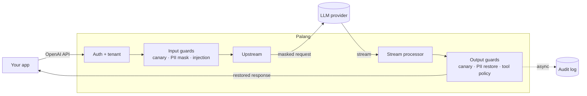

<div align="center">


<h3>A security gateway for LLM apps, built for Indonesian data.</h3>

<p>
  
  
  
</p>

<p>
  <a href="#get-started">Get started</a> ·
  <a href="#configuration">Configuration</a> ·
  <a href="#how-well-it-works">Evaluation</a>
</p>

</div>

<br />

Once your app talks to an LLM, three things can go wrong:

- **Personal data leaves your infrastructure.** NIKs, phone numbers and emails go straight to a
  third-party model.
- **Instructions hide in content.** A web page or tool result can tell your agent to "ignore
  previous instructions".
- **Tool calls have real effects.** One bad call can move money or delete data.

Palang sits between your app and the model and checks everything that passes through. Adopting it
is a one-line change:

```diff
- baseURL: "https://api.openai.com/v1",
+ baseURL: "https://palang.your-company.internal/v1",
```

What that changes for a single message:

```text
Your user sends      →  "NIK saya 3171011506900001, tolong cek statusnya"
The model receives   →  "NIK saya [NIK_1], tolong cek statusnya"
Your user gets back  →  "Status untuk 3171011506900001: aktif."
```

## What it does

|---|---|
| **PII masking** | NIK, NPWP, phone numbers, emails and card numbers never reach the model. They're masked in every text field of the request and restored in the reply, streaming included. |
| **Injection detection** | Flags or blocks prompt injection in user and tool messages, in English and Indonesian. |
| **Tool-call policy** | Allows only the tools you list, with limits on their arguments. |
| **Leak detection** | Catches your system prompt showing up in the output. |

Each guard can run in `monitor` mode (log only) before you `enforce` it. Every request lands in an
audit log, a dashboard and Prometheus metrics.

<details>
<summary><b>How it works</b></summary>
<br />



- Guards run in order: PII is masked before the injection scan, and restored before the tool
  policy checks arguments.
- The audit log is written in the background, so it never slows a request down.

</details>

> [!NOTE]
> Pre-release. Run it from source for now; container images and an npm package are on the way.

## Get started

This sets Palang up in front of your own app and model provider. Plan on about fifteen minutes.

### What you need

| | |
|---|---|
| [Bun](https://bun.sh) 1.3+ | runs the gateway (`bun --version`) |
| [Node.js](https://nodejs.org) 22+ | runs the dashboard (`node --version`) |
| Postgres 16 | stores the audit log and API keys; Docker is the quickest way to get one |
| An OpenAI-compatible API | OpenAI, or any provider or self-hosted server that speaks the same API, plus its API key |

No API key at hand? You can [try Palang with a mock model](#try-it-without-an-api-key) first.

### 1. Install

```sh
git clone <this-repo-url> palang-ai
cd palang-ai
bun install
```

### 2. Start Postgres

Skip this if you already have a Postgres 16 server. Otherwise, this container keeps its data in a
named volume so it survives restarts:

```sh
docker run -d --name palang-postgres \
  -e POSTGRES_USER=palang -e POSTGRES_PASSWORD=palang -e POSTGRES_DB=palang \
  -p 5432:5432 -v palang-pgdata:/var/lib/postgresql/data \
  postgres:16
```

### 3. Create your config

```sh
bun run setup
```

This creates two git-ignored files from their templates and never overwrites existing ones:

- **`.env`** holds secrets and connection settings. An admin token and a dashboard password are
  generated for you, and the password is printed once.
- **`palang.yaml`** describes your app (a *tenant*), its model provider and its guards.

Now make them yours.

**In `.env`**, point Palang at your model provider (and at your database, if it isn't the
container above):

```sh
UPSTREAM_BASE_URL=https://api.openai.com/v1
UPSTREAM_API_KEY=sk-...
```

**In `palang.yaml`**, describe your app. Rename the example tenant, list the models your app uses,
and start the guards in `monitor` mode so nothing gets blocked while you learn what your traffic
looks like:

```yaml
tenants:
  - id: my-app                      # used in the dashboard and when creating API keys
    failure_mode: fail_closed
    upstream:
      type: openai-compatible
      base_url: ${UPSTREAM_BASE_URL}
      api_key: ${UPSTREAM_API_KEY}
    allowed_models: ["gpt-4o-mini", "gpt-4o"]   # globs work too, e.g. "gpt-4o*"
    guards:
      pii-id:                       # masking happens in either mode
        mode: enforce
        entities: [NIK, NPWP, PHONE_ID, EMAIL, CARD]
      injection:
        mode: monitor
      canary:
        mode: monitor
        on_detect: block
      tool-policy:
        mode: monitor
        default: deny
        rules: []                   # add your tools before enforcing, see Configuration
```

Every setting is explained in [`.env.example`](.env.example) and
[`palang.example.yaml`](palang.example.yaml).

### 4. Create the database tables

```sh
bun run db:migrate
```

### 5. Start Palang

Run each of these in its own terminal:

```sh
bun run gateway     # your app talks to :8080, the admin API is on :8081
```

```sh
bun run dashboard   # builds, then serves on http://localhost:3000
```

Open <http://localhost:3000> and sign in with the password from `.env`.

### 6. Give your app an API key

Your app authenticates to Palang with its own key, never the provider's. In the dashboard, go to
**API keys**, pick your tenant and create a key. Copy it right away, because it's shown only once.

<details>
<summary>Prefer the command line?</summary>

```sh
export PALANG_ADMIN_TOKEN=$(grep '^PALANG_ADMIN_TOKEN=' .env | cut -d= -f2)

curl -s -X POST localhost:8081/admin/tenants/my-app/keys \
  -H "Authorization: Bearer $PALANG_ADMIN_TOKEN" \
  -H 'content-type: application/json' -d '{"name":"production"}'
```

</details>

### 7. Connect your app

Keep using the OpenAI SDK you already use. Only the base URL and the key change:

```ts
import OpenAI from "openai";

const client = new OpenAI({
  baseURL: "http://localhost:8080/v1", // your Palang gateway
  apiKey: process.env.PALANG_API_KEY, // the key from step 6
});

const reply = await client.chat.completions.create({
  model: "gpt-4o-mini",
  messages: [{ role: "user", content: "NIK saya 3171011506900001, tolong cek statusnya" }],
});
```

Streaming, tool calls and every other OpenAI-compatible SDK work the same way. Send a request and
it shows up under **Events** in the dashboard, with each guard's decision.

### 8. From monitoring to enforcing

Let real traffic run through for a while, then use the dashboard to decide what to block:

1. **Overview** shows how much each guard *would* have blocked, and **Events** shows why, request
   by request.
2. Add your tools to `tool-policy` and tune the injection thresholds until the would-blocks look
   right.
3. Switch the guards you trust to `mode: enforce` and restart the gateway. Config is read at
   startup.

### Try it without an API key

Palang ships with a mock model server that speaks the OpenAI API. Keep the `UPSTREAM_*` values
from `bun run setup`, leave the example tenant (`demo`) as it is, then:

```sh
bun run mock        # in its own terminal, next to the gateway
```

Create a key for the `demo` tenant and use the model `mock-echo`, which repeats your message
back. Send it a NIK and you get the NIK back, while the "model" only ever saw `[NIK_1]`.

## Configuration

| File | Holds | Template |
|---|---|---|
| `palang.yaml` | Tenants, providers and guards | [`palang.example.yaml`](palang.example.yaml) |
| `.env` | Secrets, shared by the gateway, dashboard and migrations | [`.env.example`](.env.example) |

<details>
<summary><b>All guard options</b></summary>
<br />

```yaml
guards:
  pii-id:
    mode: enforce
    entities: [NIK, NPWP, PHONE_ID, EMAIL, CARD]
    mask_new_output_pii: false     # also mask PII the model writes itself
  injection:
    mode: monitor
    flag_threshold: 0.5
    block_threshold: 0.85
  tool-policy:
    mode: enforce
    default: deny                  # anything not matched is blocked
    rules:
      - { tool: "search_*", action: allow }
      - { tool: "delete_*", action: deny, reason: destructive_tool }
      - tool: transfer_funds
        action: allow
        constraints:               # all must pass
          - { path: amount, op: lte, value: 1000000 }
          - { path: currency, op: in, value: [IDR] }
  canary:
    mode: enforce
    on_detect: block               # or flag: strip the token and continue
```

- `failure_mode: fail_closed` blocks a request when a guard errors; `fail_open` lets it through.
  `pii-id` always blocks on error, so PII is never sent unmasked.
- An optional ML classifier improves injection detection but is slow on CPU. Read
  [decision 0005](docs/decisions/0005-injection-l2-classifier.md) before enabling it.

</details>

## Use it as a library

`@palang-ai/guards` has no dependencies and runs on Node, Bun, Deno and the edge. Not on npm yet;
inside this repo:

```ts
import { DEFAULT_PII_ID_CONFIG, createPiiIdInputGuard, type GuardContext } from "@palang-ai/guards";

const ctx: GuardContext = {
  requestId: crypto.randomUUID(),
  tenantId: "local",
  model: "gpt-4o-mini",
  stream: false,
  messages: [{ role: "user", content: "NIK saya 3171011506900001" }],
  piiVault: new Map(),
  signal: new AbortController().signal,
  metadata: {},
};

await createPiiIdInputGuard(DEFAULT_PII_ID_CONFIG).check(ctx);
ctx.messages[0]?.content; // "NIK saya [NIK_1]"
```

## How well it works

Detection quality is measured, not claimed. `bun run eval` reproduces the report on synthetic
datasets, and results are kept in [`evals/results/`](evals/results/).

**Prompt injection**, on a held-out test set at the flag threshold (0.5):

| Layer | Recall | False positives | Recall (ID) | Recall (EN) |
|---|---:|---:|---:|---:|
| Heuristics only | 48.3% | 22.9% | 51.6% | 41.7% |
| Classifier only | 81.3% | 27.1% | 71.9% | 100% |
| **Combined** | **92.4%** | 39.9% | 88.5% | 100% |

**PII**, on 550 synthetic samples: **93.0% precision and 99.7% recall** on supported formats, and
the streaming restore round trip succeeds on **100%** of masked samples.

> [!IMPORTANT]
> The datasets are synthetic, and the heuristics were written by the same author as the samples,
> so treat these numbers as optimistic. The combined false-positive rate is too high to block on,
> which is why `injection` should start in `monitor` mode.

## Known limitations

- Audit events can be lost on a crash, since the queue lives in memory.
- A block during streaming can't take back text that was already sent.
- The classifier is weaker on Indonesian than on English.
- Any 15-digit number is treated as an NPWP.
- Dashboard sign-in is rate-limited globally, so someone guessing passwords nonstop can keep you
  out too. Don't expose the dashboard to the public internet.
- Only OpenAI-compatible providers are supported.
- `logprobs` are dropped, since they would expose the unguarded output. The legacy `functions`
  API is rejected with a 400; use `tools`.

## Contributing

```sh
bun run typecheck && bun run test   # gateway tests need DATABASE_URL (Postgres 16)
bun run lint
```

Five workspaces: `gateway/`, `dashboard/`, `guards/`, `mock-upstream/` and `evals/`. The technical
spec is in [`docs/TSD.md`](docs/TSD.md), and design decisions in [`docs/decisions/`](docs/decisions/).

## License

[MIT](LICENSE) © 2026 [@iqbalr3000](https://github.com/iqbalr3000)

The optional classifier model is Apache-2.0 and downloaded separately. `sharp`/libvips, installed
by `@huggingface/transformers`, is LGPL-3.0-or-later.
