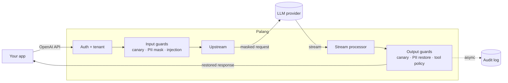

<div align="center">


### A security gateway for LLM apps, built for Indonesian data.

Mask PII, catch prompt injection and police tool calls, without changing your code.

<p>
  
  
  
  
</p>

<p>
  <a href="#features"><b>Features</b></a> &nbsp;·&nbsp;
  <a href="#quick-start"><b>Quick start</b></a> &nbsp;·&nbsp;
  <a href="#configuration"><b>Configuration</b></a> &nbsp;·&nbsp;
  <a href="#evaluation"><b>Evaluation</b></a>
</p>

</div>

---

Palang sits between your app and the model and checks everything that passes through. Adopting it
is a one-line change:

```diff
- baseURL: "https://api.openai.com/v1",
+ baseURL: "https://palang.your-company.internal/v1",
```

```text
Your user sends      →  "NIK saya 3171011506900001, tolong cek statusnya"
The model receives   →  "NIK saya [NIK_1], tolong cek statusnya"
Your user gets back  →  "Status untuk 3171011506900001: aktif."
```

## Features

| | |
|---|---|
| **PII masking** | NIK, NPWP, phone numbers, emails and card numbers are masked before they reach the model and restored in the reply, streaming included. |
| **Injection detection** | Flags or blocks prompt injection in user and tool messages, in English and Indonesian. |
| **Tool-call policy** | Allows only the tools you list, with limits on their arguments. |
| **Leak detection** | Catches your system prompt showing up in the output. |
| **Observability** | Every request lands in an audit log, a dashboard and Prometheus metrics. |

Every guard can run in `monitor` mode (log only) before you `enforce` it.

### How it works



PII is masked before the injection scan and restored before the tool policy checks arguments. The
audit log is written in the background, so it never slows a request down.

## Quick start

> [!NOTE]
> Pre-release: run it from source for now. Container images and an npm package are on the way.

**Requirements:** [Bun](https://bun.sh) 1.3+, [Node.js](https://nodejs.org) 22+, Postgres 16,
and an OpenAI-compatible API key. No key yet? [Try it with a mock model](#try-it-without-an-api-key).

### 1. Install and start Postgres

```sh
git clone <this-repo-url> palang-ai && cd palang-ai
bun install

# skip if you already run Postgres 16
docker run -d --name palang-postgres \
  -e POSTGRES_USER=palang -e POSTGRES_PASSWORD=palang -e POSTGRES_DB=palang \
  -p 5432:5432 -v palang-pgdata:/var/lib/postgresql/data \
  postgres:16
```

### 2. Configure

```sh
bun run setup
```

This creates `.env` (secrets, with a generated admin token and dashboard password) and
`palang.yaml` (your tenants and guards). Existing files are never overwritten.

Point `.env` at your model provider:

```sh
UPSTREAM_BASE_URL=https://api.openai.com/v1
UPSTREAM_API_KEY=sk-...
```

Then describe your app in `palang.yaml`. Start the guards in `monitor` mode so nothing is blocked
while you learn what your traffic looks like:

```yaml
tenants:
  - id: my-app
    failure_mode: fail_closed
    upstream:
      type: openai-compatible
      base_url: ${UPSTREAM_BASE_URL}
      api_key: ${UPSTREAM_API_KEY}
    allowed_models: ["gpt-4o-mini", "gpt-4o"]   # globs work too, e.g. "gpt-4o*"
    guards:
      pii-id:                                    # masks in either mode
        mode: enforce
        entities: [NIK, NPWP, PHONE_ID, EMAIL, CARD]
      injection:   { mode: monitor }
      canary:      { mode: monitor, on_detect: block }
      tool-policy: { mode: monitor, default: deny, rules: [] }
```

Every option is documented in [`.env.example`](.env.example) and
[`palang.example.yaml`](palang.example.yaml).

### 3. Run

```sh
bun run db:migrate
bun run gateway     # app traffic on :8080, admin API on :8081
bun run dashboard   # http://localhost:3000, in a second terminal
```

Sign in to the dashboard with the password from `.env`.

### 4. Connect your app

Create an API key under **API keys** in the dashboard (it's shown only once), then keep using the
OpenAI SDK you already have:

```ts
import OpenAI from "openai";

const client = new OpenAI({
  baseURL: "http://localhost:8080/v1",
  apiKey: process.env.PALANG_API_KEY,
});

await client.chat.completions.create({
  model: "gpt-4o-mini",
  messages: [{ role: "user", content: "NIK saya 3171011506900001, tolong cek statusnya" }],
});
```

Streaming and tool calls work the same way. Each request shows up under **Events**, with every
guard's decision.

<details>
<summary>Create a key from the command line instead</summary>

```sh
export PALANG_ADMIN_TOKEN=$(grep '^PALANG_ADMIN_TOKEN=' .env | cut -d= -f2)

curl -s -X POST localhost:8081/admin/tenants/my-app/keys \
  -H "Authorization: Bearer $PALANG_ADMIN_TOKEN" \
  -H 'content-type: application/json' -d '{"name":"production"}'
```

</details>

### 5. Go from monitoring to enforcing

1. **Overview** shows what each guard *would* have blocked; **Events** shows why.
2. Add your tools to `tool-policy` and tune the injection thresholds.
3. Switch trusted guards to `mode: enforce` and restart the gateway.

### Try it without an API key

Keep the defaults from `bun run setup` and start the bundled mock model next to the gateway:

```sh
bun run mock
```

Create a key for the `demo` tenant and call the model `mock-echo`. Send it a NIK and you get the
NIK back, while the "model" only ever saw `[NIK_1]`.

## Configuration

| File | Holds | Template |
|---|---|---|
| `palang.yaml` | Tenants, providers and guards | [`palang.example.yaml`](palang.example.yaml) |
| `.env` | Secrets shared by the gateway, dashboard and migrations | [`.env.example`](.env.example) |

<details>
<summary><b>All guard options</b></summary>
<br />

```yaml
guards:
  pii-id:
    mode: enforce
    entities: [NIK, NPWP, PHONE_ID, EMAIL, CARD]
    mask_new_output_pii: false     # also mask PII the model writes itself
  injection:
    mode: monitor
    flag_threshold: 0.5
    block_threshold: 0.85
  tool-policy:
    mode: enforce
    default: deny                  # anything not matched is blocked
    rules:
      - { tool: "search_*", action: allow }
      - { tool: "delete_*", action: deny, reason: destructive_tool }
      - tool: transfer_funds
        action: allow
        constraints:               # all must pass
          - { path: amount, op: lte, value: 1000000 }
          - { path: currency, op: in, value: [IDR] }
  canary:
    mode: enforce
    on_detect: block               # or flag: strip the token and continue
```

- `failure_mode: fail_closed` blocks a request when a guard errors; `fail_open` lets it through.
  `pii-id` always blocks on error, so PII is never sent unmasked.
- An optional ML classifier improves injection detection but is slow on CPU. Read
  [decision 0005](docs/decisions/0005-injection-l2-classifier.md) before enabling it.

</details>

## Use it as a library

`@palang-ai/guards` has no dependencies and runs on Node, Bun, Deno and the edge. It isn't on npm
yet, so use it from inside this repo:

```ts
import { DEFAULT_PII_ID_CONFIG, createPiiIdInputGuard, type GuardContext } from "@palang-ai/guards";

const ctx: GuardContext = {
  requestId: crypto.randomUUID(),
  tenantId: "local",
  model: "gpt-4o-mini",
  stream: false,
  messages: [{ role: "user", content: "NIK saya 3171011506900001" }],
  piiVault: new Map(),
  signal: new AbortController().signal,
  metadata: {},
};

await createPiiIdInputGuard(DEFAULT_PII_ID_CONFIG).check(ctx);
ctx.messages[0]?.content; // "NIK saya [NIK_1]"
```

## Evaluation

Detection quality is measured, not claimed. `bun run eval` reproduces the report on synthetic
datasets; results live in [`evals/results/`](evals/results/).

**Prompt injection**, held-out test set, flag threshold 0.5:

| Layer | Recall | False positives | Recall (ID) | Recall (EN) |
|---|---:|---:|---:|---:|
| Heuristics only | 48.3% | 22.9% | 51.6% | 41.7% |
| Classifier only | 81.3% | 27.1% | 71.9% | 100% |
| **Combined** | **92.4%** | 39.9% | 88.5% | 100% |

**PII**, 550 synthetic samples: **93.0% precision** and **99.7% recall** on supported formats, and
**100%** of masked samples survive the streaming restore round trip.

> [!IMPORTANT]
> The datasets are synthetic and the heuristics were written by the same author as the samples, so
> treat these numbers as optimistic. The combined false-positive rate is too high to block on,
> which is why `injection` should start in `monitor` mode.

## License

[MIT](LICENSE) © 2026 [@iqbalr3000](https://github.com/iqbalr3000)

The optional classifier model is Apache-2.0 and downloaded separately. `sharp`/libvips, installed
by `@huggingface/transformers`, is LGPL-3.0-or-later.
